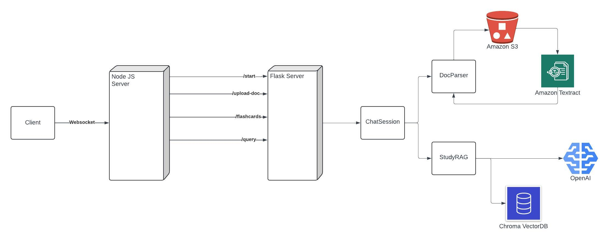
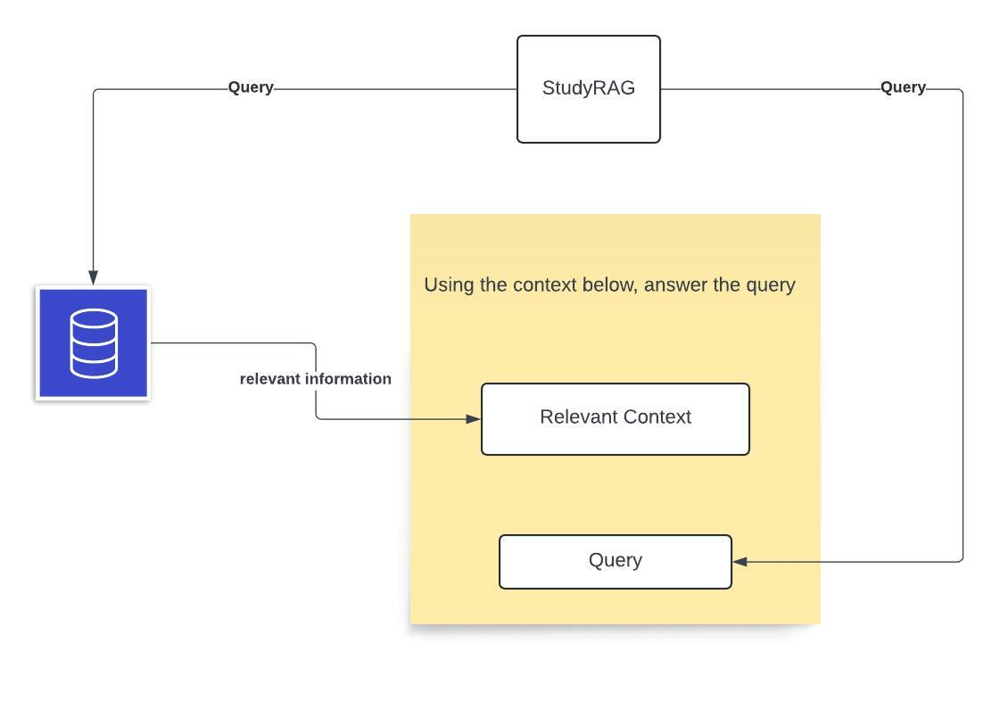

# Study Buddy
This feature offers users an AI assistant to help them study better.\
Users can upload a document(Up to 16MB) and then use Study Buddy to:
* Generate flashcards from the document
* Ask questions about the material in the document

Check it out: http://44.231.100.201/

# Getting Started
### Flask Server
To start the Flask server:
* Enter the `ai-feature/` directory
* Install python virtual environment library `pip3 install virtualenv`
* Create a virtual environment `virtualenv aiDev`
* Activate the environment `source aiDev/bin/activate`
* Install the required libraries `pip3 install -r ./requirements.txt`
* Set the API keys and secrets as environment variables(Submitted on Canvas)
* Start the Flask server `python3 app.py`
Clients don't directly interact with this server. This is only accessed by the Node server and exposes AI functionality through REST API.
### Node Js Server
To start the Node server:
* Install the requirements: ```npm install```
* Set environment to development: ```export ENV="DEV"```
* Start the server: ```node server.js```
### MongoDB Database
Make sure to restart the database using `initdb.mongo` script.

# Design of AI feature
### General Flow of Information
The client starts Study Buddy by uploading a document.\
Client-side JS will send the document through the websocket to the Node backend.\
Node backend will then save the document to the file system, and then start communicating with the Flask server.
1. Node server makes a `POST` request to `/start` with `username` of the client
2. The Flask server will create a `ChatSession` for this username
3. Node server sends the path to the document via a `POST` request to `/upload-doc`
4. The Flask server will receive the path to the document, and will parse the document `ChatSession::parse_doc()`
5. The Node server will make a `GET` request to `/flashcards` to acquire the flashcards text
6. The Flask server will now generate the flashcards `ChatSession::generate_flashcards()`
7. The Node server will store the flashcard texts and send a link to the flashcards back to the client

The client can now view the flashcards through the link. <br>
Clients can ask questions by simply sending a message in the Study Buddy room. <br>
Client-side JS will send the text through the websocket to the Node backend. <br>
Node backend will then send the question to the Flask server by making a `GET` request to `/query`, and the Flask server will generate the answer by calling `ChatSession::generate_response()`. The node server will then send the answer back to the client.<br>
Once the user is done with this document, they can upload another one and start a new session.<br>

     

Each user has a `ChatSession` object associated with them, and all of their requests are managed through this. This object has two main fields, a `DocParser` object and a `StudyRAG` object.
* `DocParser`: Responsible for extracting the text from the document. We extract the text using the `Amazon Textract` service.
> Why `Amazon Textract`?\
Before using this service, we tried multiple alternatives and tried to parse the document locally. We tried using `PyPDF` library, `tesseract` OCR engine, and `Langchain.PyPDFLoader`; However each of these had their own issues. 
> * `PyPDF` failed to parse some documents that included emojis! (Not sure how accurate this is, but we weren't able to parse the `AI-llm-foundations.pdf` CPEN 322 lecture, and our best guess is that some pages include unknown image formats)
> * `tesseract`: this only supported images, and not pdf files, so we had to convert pdf files to images, and then use this, which wasn't optimal
> *  `Langchain.PyPDFLoader`: this gave the best result out of the 3, however, took a very very long time to extract the text, more than 5 minutes for a 30-page pdf file, compared to `Amazon Textract` that completed the task in less than a minute.

We first upload the file to a `S3 Bucket`, and then pass the location to `Textract` to receive the text from the document.


* `StudyRAG`: Responsible for generating flashcards and answering user queries. To achieve this, we use the Retrieval-augmented generation (RAG) technique. We use a `ChromaDB` instance that we run locally as our vector database, and `gpt-3.5-turbo` API through `Langchain`.
> * Why `OpenAI` API?\
Before using this service, we explored multiple open-source options from HuggingFace, such as `google/deplot`, `google/flan-t5-xxl`, however, the biggest issue that we faced was that each of these models were specific to a certain application, like document question answering, or text-2-text generation, however, we needed a more general model that can handle both document QA and text generation. Also, we needed a model that could be used with LandgChain, because we needed to use Langchain's output parsers, to be able to automate the process of flashcard generation and display.

To generate flashcards or answer queries, we will first extract the relevant information from the document text, which is now stored in a vector database instance, and then send the augmented query to OpenAI API.

     

### Deployment
We deployed the application to an EC2 instance hosted on AWS. We're using process manager `pm2` to manage the running Node js/Flask servers. The Flask endpoints are not public, and can only be accessed from the Node Js backend. 
